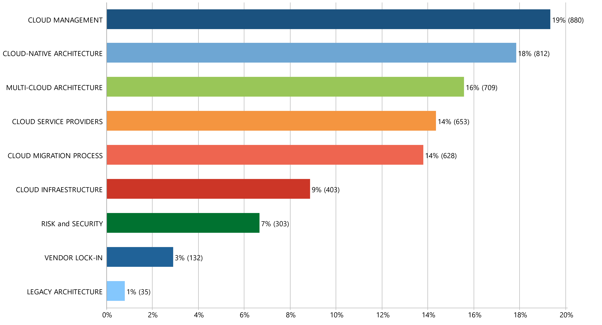

# Multi-Cloud Migration: A Systematic Literature Review

### Benefits and Challenges to Multi-Cloud Migration

|  #  | Code                           | Quotations |     %     | Link  | 
|:---:|:-------------------------------|:----------:|:---------:|:-----:|
| 01  |CLOUD MANAGEMENT                |  880.00    |  19.32%   |   [page](files/code_segments/01-CLOUD_MANAGEMENT.pdf)    |
| 02  |CLOUD-NATIVE ARCHITECTURE       |  812.00    |  17.83%   |       |
| 03  |MULTI-CLOUD ARCHITECTURE        |  709.00    |  15.57%   |       |
| 04  |CLOUD SERVICE PROVIDERS         |  653.00    |  14.34%   |       |
| 05  |CLOUD MIGRATION PROCESS         |  628.00    |  13.79%   |       |
| 06  |CLOUD INFRAESTRUCTURE           |  403.00    |   8.85%   |       |
| 07  |RISK and SECURITY               |  303.00    |   6.65%   |       |
| 08  |VENDOR LOCK-IN                  |  132.00    |   2.90%   |       |
| 09  |LEGACY ARCHITECTURE             |  35.00     |   0.77%   |       |

[:arrow_up:](#resultados)

 

.
